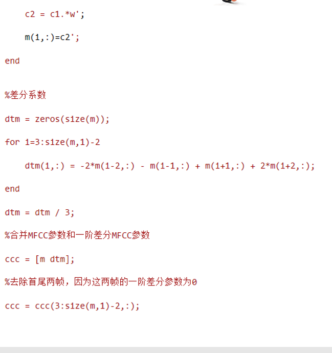
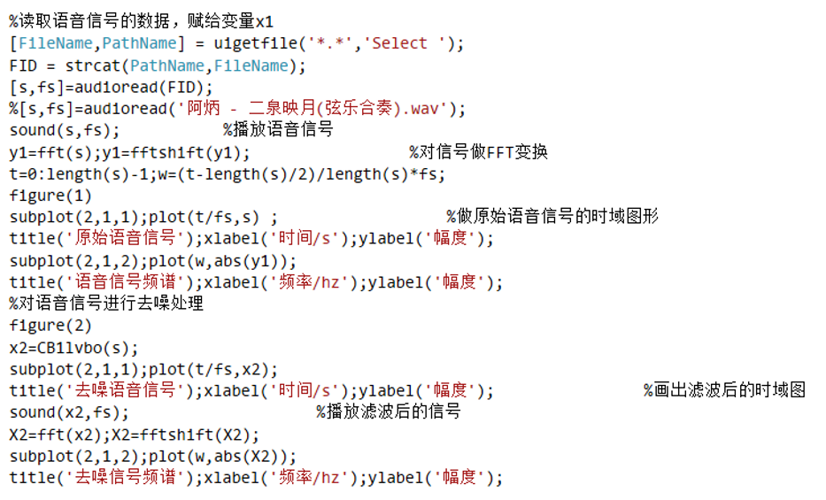

<!--
 * @Descripttion: 
 * @version: 
 * @Author: 32353
 * @Date: 2021-03-21 14:40:40
 * @LastEditors: 32353
 * @LastEditTime: 2021-03-21 16:23:28
-->

# 基于信号频谱分析的方法实现音乐识别

《数字信号处理》课程的大作业，通过Matlab对声音信号的读取，频谱分析，比较，得到识别结果，预先存储的歌曲信息中只有几首歌，总体而言比较简单，主要是对频谱信号的分析处理。（2019.06.09）

由于时间比较久远，已经找不到当时的代码和最终版的汇报PPT，只有一个开始的非Release版本。基本上这也算是第一次和编程相关的实践（数据结构的课程设计是文件对比查重，但是是C语言写的而且只有二百来行，是一个单独的文件，感觉算不上是一个“项目”）。在图片中记录了一些当时的代码片段。

## 一、作业背景

音乐检索的主要方法是基于内容的检索，即利用音乐的音符、旋律、节奏、歌曲风格等语义级的特征或者声学层特征从数据库中检索乐曲。本研究专题为使用基于信号频谱分析的方法实现音乐检索。

## 二、系统概况


系统整体包含两部分，第一部分为模板库的构建，第二部分为音乐信号的识别。

1. 模板库的构建：首先在网上下载多首音乐，然后对每首音乐提取特征，多首音乐的特征即构成模板库。音乐信号并不是一个平稳随机过程，所以不能直接对整个信号进行频谱分析，需要对其进行加窗分帧操作。将音乐信号分为毫秒级的多个音乐片段，每个音乐片段可以看做是平稳随机过程，然后对音乐片段进行频谱分析。为了保证两个音乐片段之间的平滑过渡，需要设置一个偏移量，也就是前后两帧的数据需要共同拥有同一节数据，偏移量一般设置为帧长的二分之一。加窗分帧操作可以通过窗函数实现，每移动一次窗函数，便得到一帧的音乐片段。
2. 音乐信号的识别：打开麦克风对播放音乐进行录制,按照模板库构建过程，对信号进行加窗分帧和特征提取，最后将待识别信号的特征与模板库进行匹配，得到该首音乐的歌曲名称。
3. 补充。为提高歌曲识别的速度，可以对音乐信号进行降采样处理，需要结合信号抽样和多速率信号处理理论，对音乐信号的频谱进行分析，得到合适的降采样率，以达到在不造成频谱混叠的情况下降低处理的数据量。

## 三、实验原理：梅尔频谱系数计算与DTW动态时间规整算法

### 3.1 MFCC频谱算法

MFCC是在Mel标度频率域提取出来的倒谱参数，Mel标度描述了人耳频率的非线性特性，它与频率的关系可用下式近似表示：   
Mel(f) = 2595 * lg(1 + f / 700)
式中f为频率，单位为Hz。下图为Mel频率与线性频率的关系：


声道的形状在语音短时功率谱的包络中显示出来。而MFCCs就是一种准确描述这个包络的一种特征。MFCCs（Mel Frequency Cepstral Coefficents）是一种在自动语音和说话人识别中广泛使用的特征。它是在1980年由Davis和Mermelstein提出来的。

具体使用MFCC处理语音信号的基本步骤有预加重——分帧 ——加窗——频域转换——使用梅尔刻度滤波器组过滤——能量值取log——离散余弦变换——差分，下面将逐一介绍。

- 预加重，将语音信号通过高通滤波器，提升其高频部分，使信号的频谱变得平坦，保持在低频到高频的整个频带中，能用同样的信噪比求频谱。目的是消除发声过程中，声带和嘴唇造成的效应，来补偿语音信号受到发音系统所压抑的高频部分，并且能突显高频的共振峰。 
- 分帧，对音乐信号分段处理。先将N个采样点集合成一个观测单位，称为帧。通常情况下N的值为256或512，涵盖的时间约为20~30ms左右。为了避免相邻两帧的变化过大，因此会让两相邻帧之间有一段重叠区域，此重叠区域包含了M个取样点，通常M的值约为N的1/2或1/3。目的是对整段语音信号分帧，即切分成很多段，当整段信号不平滑时，分成小份的信号，使小段的信号看起来是稳定平滑的（即保证其为分段平稳随机过程）。
- 加窗，分帧越多与原始信号的误差也就越大，加窗就是为了解决这个问题，使分帧后的信号变得连续，每一帧就会表现出周期函数的特征。用于平滑信号，使用汉明窗加以平滑的话，相比于矩形窗函数，会减弱FFT以后旁瓣大小以及频谱泄露。
频域转换，目的是将时域信号转化到频域进行后续的频率分析。
- 使用梅尔刻度滤波器组过滤，因为频域信号有很多冗余，滤波器组可以对频域的幅值进行精简，每一个频段用一个值来表示。实现：对于FFT得到的幅度谱，分别跟每一个滤波器进行频率相乘累加，得到的值即为该帧数据在在该滤波器对应频段的能量值。
- 能量值取log由于人耳对声音的感知并不是线性的，用log这种非线性关系更好描述。取完log以后才可以进行倒谱分析。
离散余弦变换DCT和DFT类似，但是只使用实数，不涉及复数运算。信号经过DCT变换以后，能量会集中到低频部分，可以用于图像压缩。目的 ：按照倒谱的定义，该步需要进行反傅里叶变换然后通过低通滤波器获得最后的低频信号。这里使用DCT直接就可以获取频率谱的低频信息。由于滤波器之间是有重叠的，所以前面的获得的能量值之间是具有相关性的，DCT还可以对数据进行降维压缩和抽象，获得最后的特征参数。相比于傅里叶变换，离散余弦变换的结果没有虚部，更好计算。
- 差分，由于语音信号是时域连续的，分帧提取的特征信息只反应了本帧语音的特性，为了使特征更能体现时域连续性，可以在特征维度增加前后帧信息的维度。常用的是一阶差分和二阶差分。

### 3.2 DTW动态时间规整算法

在时间序列中，需要比较相似性的两段时间序列的长度可能并不相等，在语音识别领域表现为不同人的语速不同。而且同一个单词内的不同音素的发音速度也不同，比如有的人会把“A”这个音拖得很长，或者把“i”发的很短。另外，不同时间序列可能仅仅存在时间轴上的位移，亦即在还原位移的情况下，两个时间序列是一致的。在这些复杂情况下，使用传统的欧几里得距离无法有效地求的两个时间序列之间的距离（或者相似性）。

DTW通过把时间序列进行延伸和缩短，来计算两个时间序列性之间的相似性：为了对齐两个向量,我们可以构造一个m×n的矩阵,矩阵元素(i,j)表示的是Pi到Qj的距离D(Pi,Qj)(也就是向量P中每一个点同Q中每一个点的距离,这个距离越小表明相似度越高)。其中 D（P_i，Q_j）=（P_i－Q_j）^2 矩阵中的每一个点都表示Pi和Qj的对齐。动态规划算法就是寻找一条通过矩阵中网格中若干格点的路径，格点表明的是向量P和向量Q中对齐的点，路径是由左下角指向右上角。

那么这条路径，我们怎么才能找到呢？
首先我们定义这条路径为W，W中的第K的元素可以表示为wk=(i,j)k,，接着，这条路径不是随意求出的,需要满足几个约束条件：

- 边界条件:w1=(1, 1)和wK=(m, n)。对于任何语音信号来说，可能会有快慢的不同，但是一定都是按着时间顺序出现的，意思是说这条路径一定是从左下角延伸到右上角的
- 连续性：对于路径中的一点wk-1= (a’, b’)，它的下一个点wk=(a, b)需要满足 (a-a’) <=1和 (b-b’) <=1。这样就可以保证它只能和自己相邻的点对齐，Q和C中的每个坐标也都可以在W中出现。
- 单调性：对于路径中的一点wk-1= (a’, b’)，它的下一个点wk=(a, b)需要满足0<=(a-a’)和0<= (b-b’)。这样就可以保证路径上的点是随着时间单调前进的。

当满足上面的三条约束后，每一个格点上路径前进的方向就被固定为三个方向中的一个。比如说，路径通过了格点(i, j)，那么它的下一个点就只能是下列中的一个(i+1, j)，(i, j+1)或者(i+1, j+1)。但是每一个格点都遍历的话，得到的路径数量是指数级的。我们应该在选取每一个格点路径的时候，都进行一次选择，就是选择三个方向中最小值的那一条。

这里我们可以定义一个累积距离。为匹配这两个序列P和Q，从(0, 0)格点开始计算，每到一个格点，之前所有的格点计算出的最短距离都会被累加。直到达终点(m, n)后，这个累积距离就是前面所说的最小时间距离，也就是序列P和Q的相似度。
利用已给好的dtw.m文件，设计一个循环，分别分析选择的语音信号和存储的音乐库中的特征匹配程度，计算出相似度后，选择最小值，即为最匹配的歌曲，将它的名字输出。

## 四、具体步骤

### 4.1 MFCC算法实现，计算频谱

对应matlab程序附件的’mfcc_m.m’(定义提取特征参数函数)，’yinyueku.m’(提取五首歌曲特征参数)，’特征参数.mat’(存储歌曲的特征参数)文件。
在上面所述的特征提取中，使用梅尔频率倒谱系数（MFCC），将Mel频率倒谱系数作为特征参数（设计mfcc_m函数）
使用梅尔频率分析语音信号的Matlab程序如下三张图所示

<html>
<div>
    
    
    
</div>
</html>

### 4.2 模板库的建立

选取三到五首歌曲，作为模板库，为保证检索在较短时间内完成，数据库每首音乐的时间不超过10s，可将歌曲文件中间部分剪裁10s作为数据库歌曲。对所选入库歌曲进行特征提取，选择同样的特征参数，建立mat形式的库。

```matlab
[y1,Fs1]=audioread("阿炳 - 二泉映月(弦乐合奏).wav");
cc1=mfcc_m(y1,Fs1,3,50,25); 
[y2,Fs2]=audioread("许嵩 - 亲情式的爱情.wav");
cc2=mfcc_m(y2,Fs2,3,50,25); 
[y3,Fs3]=audioread("张杰 张碧晨 - 只要平凡.wav");
cc3=mfcc_m(y3,Fs3,3,50,25); 
[y4,Fs4]=audioread("张紫豪 - 可不可以.wav");
cc4=mfcc_m(y4,Fs4,3,50,25); 
[y5,Fs5]=audioread("祝酒歌.wav");
cc5=mfcc_m(y5,Fs5,3,50,25); save('特征参数','cc1','cc2','cc3','cc4','cc5');

```

选择以上歌曲，作为模板库，为保证检索在较短时间内完成，数据库每首音乐的时间不超过10s，可将歌曲文件中间部分剪裁10s作为数据库歌曲。对所选入库歌曲进行特征提取，选择同样的特征参数，建立mat形式的库。

如果判断接受的信号是属于上述内容，就会显示从对应的歌曲名字。

### 4.3 对输入信号的加载与处理

使用了Matlab的guide建立了GUI界面，我们可以手动选择歌曲，经判断之后显示出内容。大致如下所示（当时录屏的时候没有选择好，只会录下GUI的内容，但是实际上鼠标是在新打开的页面内选择了声音信号文件）。

<!-- <iframe height=498 width=510 src="img/声音信号识别.mp4"><br /> -->

[视频在本地看不到，但是它在img/声音信号识别演示.mp4目录下]

界面上有选择录音文件按钮，语音识别按钮，语音波形显示图像，一个点击显示识别结果的按钮及显示框。
选择录音文件按钮点击后，将得到的文件信息存入.mat文件，方便后续调用，并画出时域波形，点击语音识别按钮，将跳转至daoru.m，利用刚才获得的文件信息对语音信号进行滤波处理，并自动执行panduan.m，这里将进行对声音信号的梅尔频率分析(mfcc_m.m文件)，得到信号的频率特征，利用dtw.m进行相似度的比较，得到最为相似的一个文件，将文件名存储起来，传给下一级，即图形界面的结果按钮，点击该按钮后，将结果显示在该图形界面的对应文本框中，即完成了语音识别的功能。
识别过程，大概耗时8~10s，主要用时在分析声音信号的频率特征和利用循环进行相似度的对比中。

对声音信号的处理过程：

1. 选择音乐信号
（a）选择语音信号
（b）对语音信号进行去噪
    对应matlab附件的CB1lvbo.m(设计滤波器)，lvbo.m(使用滤波器滤波)
设计一个切比雪夫Ⅰ型滤波器，并对录入语音进行噪声去除。滤波器设计指标：fp1=60Hz,fp2=3400Hz,Ap=1dB,As=100dB，频率转换后ws=3rad/s。
2. 对录入的音乐信号做特征提取，对选中的语音信号进行MFCC算法。
3. 利用动态时间规整法（DTW）进行参数匹配，对应欧式距离最短的即为最佳匹配项（dtw函数）
对应matlab程序附件里的‘daoru.m’(导入录音文件) ‘dtw.m’(匹配算法)‘panduan.m’(判断匹配情况)文件。

### 4.4 DTW算法的实现，计算匹配程度

<div>
    
    <span width=5%>
    
</div>
这里我们可以定义一个累积距离。为匹配这两个序列P和Q，从(0, 0)格点开始计算，每到一个格点，之前所有的格点计算出的最短距离都会被累加。直到达终点(m, n)后，这个累积距离就是前面所说的最小时间距离，也就是序列P和Q的相似度。
利用已给好的dtw.m文件，设计一个循环，分别分析选择的语音信号和存储的音乐库中的特征匹配程度，计算出相似度后，选择最小值，即为最匹配的歌曲，将它的名字输出。

### 4.5 其他实现过程

切比雪夫Ⅰ型滤波器


使用切比雪夫Ⅰ型滤波器进行滤波


滤波器作用前后对比

<div>
    
    <span width=5%>
    
</div>

导入录音文件


判断匹配情况
<div>
    
    <span width=5%>
    
</div>
