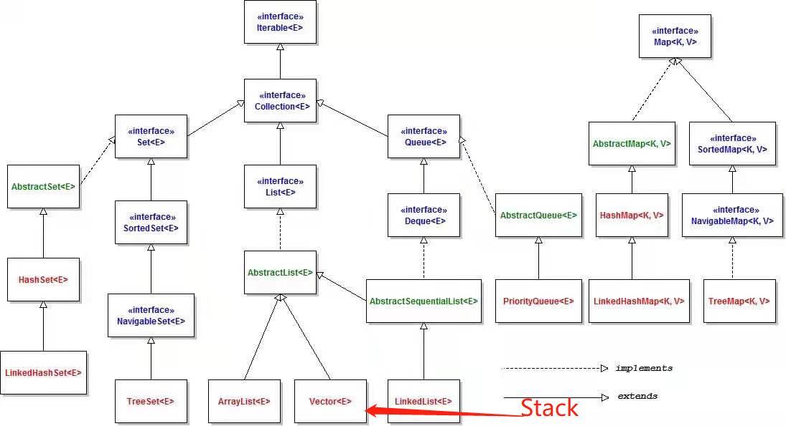

<!--
 * @Descripttion: 
 * @version: 
 * @Author: 32353
 * @Date: 2021-03-19 16:21:57
 * @LastEditors: 32353
 * @LastEditTime: 2021-03-19 16:31:20
-->

# 集合

Module java.base

Package java.util

Contains the collections framework, some internationalization support classes, a service loader, properties, random number generation, string parsing and scanning classes, base64 encoding and decoding, a bit array, and several miscellaneous utility classes. This package also contains legacy collection classes and legacy date and time classes.
Java Collections Framework
For an overview, API outline, and design rationale, please see:

Collections Framework Documentation
For a tutorial and programming guide with examples of use of the collections framework, please see:

Collections Framework Tutorial

如上是官方文档中对这个包的描述，它表明这里主要包括了与Java集合的内容，以及……巴拉巴拉，这里我们主要看集合相关的内容，这些类可以看到有如下的关系：

## 1.Collection和Interator接口

在上面的UML图中，我们可以看到对集合来说，Collection是一个极为重要的接口定义，它是List、Set和Queue的父接口，该接口中定义了size() contains(Object) iterator() toArray() add(E) remove(Object) contaisAll() remove() removeAll() retainAll() clear() equals() hashCode()等方法，他们的作用可以根据名称含义了解，除此外还定义了spliterarot()(拆分集合元素) stream()(返回以此集合为源的顺序stream)  parallelStream()方法(并行的stream)

同时，Collection接口继承了Interator接口，这意味着对于一个collection具体实现类，我们可以通过获取迭代器，根据hasNext()和next()来遍历所有元素（或者使用foreach语句）。划重点：使用迭代器访问Collection集合元素时，集合里的元素不能被改变，如果在这个迭代过程中检测到集合被修改，则会立刻引发ConcurrentModificationException异常，而不是显示修改之后的结果，这样可以避免共享资源而引发的潜在问题。

## 1.1 Connection接口的子接口——Set

Set集合的特点是添加元素无法保证顺序，并且Set不允许重复元素（当加入重复元素，会返回添加失败）。
